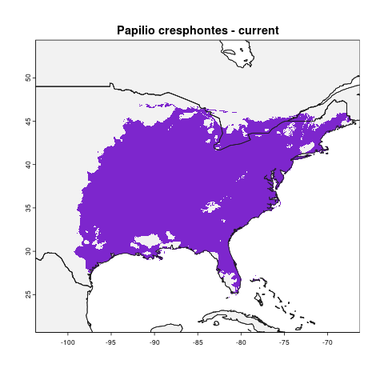
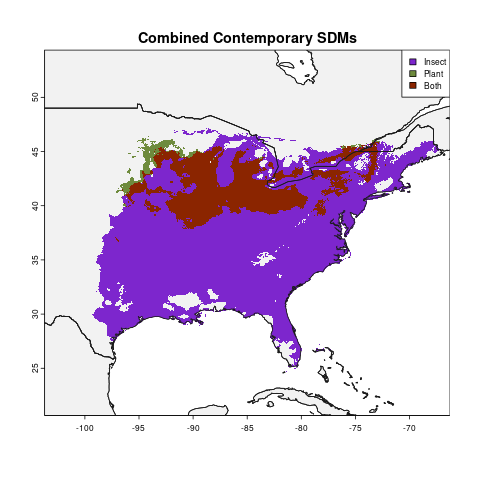
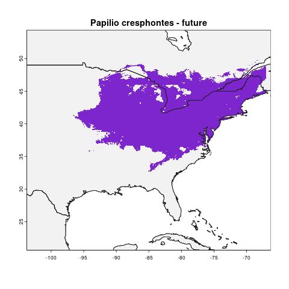
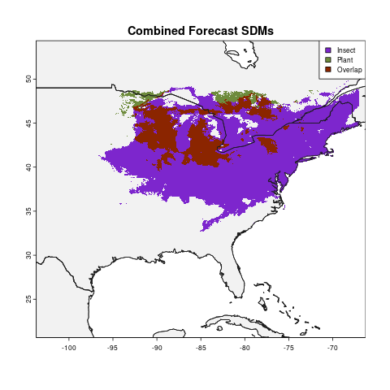

# Species Distribution Modeling
## Instructions
This document includes instructions for running species distribution modeling analyses and creating graphics. If you encounter problems, there are troubleshooting tips available on the [troubleshooting.md](troubleshoting.md) page.

### Installations
1. Install [R](http://cran.r-project.org/mirrors.html)
2. Install [RStudio](https://www.rstudio.com/products/rstudio/)
3. Install [Git](https://git-scm.org/downloads)

### Setup
1. Open RStudio and clone the Git repository at [https://github.com/jcoliver/biodiversity-sdm-lesson.git](https://github.com/jcoliver/biodiversity-sdm-lesson.git)
2. Run the setup script in RStudio by running this command in the **Console** tab of RStudio:
    `source(file = "scripts/setup.R")`
    This script may take a while to run, depending on the speed of your machine and internet connection. Note also that it may ask you if you want to restart R before installing/upgrading packages; if you receive this prompt, answer **Yes** to restarting R. This script installs additional R packages necessary for analyses, makes sure the `data` folder exists, and downloads climate data necessary to run the species distribution models. If you are prompted to choose a CRAN mirror, select the mirror that is geographically closest to you.
3. Download data for **butterfly** species from iNaturalist as a CSV file, give it a name indicating which species the data are for, and save it in the `biodiversity-sdm-lesson/data` folder; for example, if we download data for _Papilio cresphontes_, save the file as `Papilio_cresphontes_data.csv`.
4. Download data for **plant** species from iNaturalist as a CSV file, give it a name indicating which species the data are for, and save it in the `biodiversity-sdm-lesson/data` folder; for example, if we download data for _Zanthoxylum americanum_ (a host plant of _P. cresphontes_), save the file as `Zanthoxylum_americanum_data.csv`

### Running analyses
#### Single species models, current climate data
1. In the `scripts` directory, copy the file `run-sdm-single.R` and rename the copy `<species>-sdm-single.R`, replacing `<species>` with the name of the butterfly species. Use underscores instead of spaces; so for the species _Papilio cresphontes_, the file name would be `Papilio_cresphontes-sdm-single.R`.
2. Open this new file and update the following values:
    1. `butterfly.data.file <- "data/BUTTERFLY_DATA.csv"`
    Change `"BUTTERFLY_DATA.csv"` so it matches the file of butterfly data you saved in [Setup](#setup), step 3. For example, if we are analyzing the _P. cresphontes_ data, this line becomes:
    `butterfly.data.file <- "data/Papilio_cresphontes_data.csv"`
    2. `outprefix <- "MY_SPECIES"` 
    Replace `"MY_SPECIES"` with the name of the butterfly species. Use underscores instead of spaces; so for the species _P. cresphontes_, the line would read: 
    `outprefix <- "Papilio_cresphontes"`
    3. Save the file with these updates
3. Run the analyses by typing the following command in the **Console** tab of RStudio: `source(file = "scripts/<species>-sdm-single.R")`, replacing `<species>` with the species name as in step 1 of [Running analyses](#running-analyses). For the _P. cresphontes_ analysis, we would thus type the command: `source(file = "scripts/Papilio_cresphontes-sdm-single.R"`. After running this script, a map will be saved in the `output` folder; the file name will start with the value you used for "MY_SPECIES" in step 2.3, above, and end with `-single-prediction.pdf`. So for the example _P. cresphontes_, the output pdf file will be at `output/Papilio_cresphontes-single-prediction.pdf`

#### Pairwise species (butterfly & plant) models, current climate data
1. In the `scripts` directory, copy the file `run-sdm-pairwise.R` and rename the copy `<species>-sdm-pairwise.R`, replacing `<species>` with the name of the butterfly species. Use underscores instead of spaces; so for the species _Papilio cresphontes_, the file name would be `Papilio_cresphontes-sdm-pairwise.R`.
2. Open this new file and update the following values:
    1. `butterfly.data.file <- "data/BUTTERFLY_DATA.csv"`
    Change `"BUTTERFLY_DATA.csv"` so it matches the file of butterfly data you saved in [Setup](#setup), step 3. For example, if we are analyzing the _P. cresphontes_ data, this line becomes:
    `butterfly.data.file <- "data/Papilio_cresphontes_data.csv"`
    2. `plant.data.file <- "data/PLANT_DATA.csv"`
    Change `"PLANT_DATA.csv"` so it matches the file of plant data you saved in [Setup](#setup), step 4. For example, if we are using _Z. americanum_ as _P. cresphontes_' host species, this line becomes:
    `plant.data.file <- "data/Zanthoxylum_americanum_data.csv"`
    3. `outprefix <- "MY_SPECIES"` 
    Replace `"MY_SPECIES"` with the name of the butterfly species. Use underscores instead of spaces; so for the species _P. cresphontes_, the line would read: 
    `outprefix <- "Papilio_cresphontes"`
    4. Save the file with these updates
3. Run the analyses by typing the following command in the **Console** tab of RStudio: `source(file = "scripts/<species>-sdm-pairwise.R")`, replacing `<species>` with the species name as in step 1 of [Running analyses](#running-analyses). For the _P. cresphontes_ analysis, we would thus type the command: `source(file = "scripts/Papilio_cresphontes-sdm-pairwise.R"`. After running this script, two things to note:
    1. In the console you should see the % of the modeled plant's range that is occupied by the insect. Comparing this to the map, the value is the fraction of the area that is red, relative to the total red and green areas.
    2. A map will be saved in the `output` folder; the file name will start with the value you used for "MY_SPECIES" in step 2.3, above, and end with `-pairwise-prediction.pdf`. So for the example _P. cresphontes_, the output pdf file will be at `output/Papilio_cresphontes-pairwise-prediction.pdf`

#### Single species models, forecast climate data
1. In the `scripts` directory, copy the file `run-future-sdm-single.R` and rename the copy `<species>-future-sdm-single.R`, replacing `<species>` with the name of the butterfly species. Use underscores instead of spaces; so for the species _Papilio cresphontes_, the file name would be `Papilio_cresphontes-future-sdm-single.R`.
2. Open this new file and update the following values:
    1. `butterfly.data.file <- "data/BUTTERFLY_DATA.csv"`
    Change `"BUTTERFLY_DATA.csv"` so it matches the file of butterfly data you saved in [Setup](#setup), step 3. For example, if we are analyzing the _P. cresphontes_ data, this line becomes:
    `butterfly.data.file <- "data/Papilio_cresphontes_data.csv"`
    2. `outprefix <- "MY_SPECIES"` 
    Replace `"MY_SPECIES"` with the name of the butterfly species. Use underscores instead of spaces; so for the species _P. cresphontes_, the line would read: 
    `outprefix <- "Papilio_cresphontes"`
    3. Save the file with these updates
3. Run the analyses by typing the following command in the **Console** tab of RStudio: `source(file = "scripts/<species>-future-sdm-single.R")`, replacing `<species>` with the species name as in step 1 of [Running analyses](#running-analyses). For the _P. cresphontes_ analysis, we would thus type the command: `source(file = "scripts/Papilio_cresphontes-future-sdm-single.R"`. After running this script, a map will be saved in the `output` folder; the file name will start with the value you used for "MY_SPECIES" in step 2.3, above, and end with `-single-future-prediction.pdf`. So for the example _P. cresphontes_, the output pdf file will be at `output/Papilio_cresphontes-single-future-prediction.pdf`

#### Pairwise species (butterfly & plant) models, forecast climate data
1. In the `scripts` directory, copy the file `run-future-sdm-pairwise.R` and rename the copy `<species>-future-sdm-pairwise.R`, replacing `<species>` with the name of the butterfly species. Use underscores instead of spaces; so for the species _P. cresphontes_, the file name would be `Papilio_cresphontes-future-sdm-pairwise.R`.
2. Open this new file and update the following values:
    1. `butterfly.data.file <- "data/BUTTERFLY_DATA.csv"`
    Change `"BUTTERFLY_DATA.csv"` so it matches the file of butterfly data you saved in [Setup](#setup), step 3. For example, if we are analyzing the _P. cresphontes_ data, this line becomes:
    `butterfly.data.file <- "data/Papilio_cresphontes_data.csv"`
    2. `plant.data.file <- "data/PLANT_DATA.csv"`
    Change `"PLANT_DATA.csv"` so it matches the file of plant data you saved in [Setup](#setup), step 4. For example, if we are using _Z. americanum_ as _P. cresphontes_' host species, this line becomes:
    `plant.data.file <- "data/Zanthoxylum_americanum_data.csv"`
    3. `outprefix <- "MY_SPECIES"` 
    Replace `"MY_SPECIES"` with the name of the butterfly species. Use underscores instead of spaces; so for the species _P. cresphontes_, the line would read: 
    `outprefix <- "Papilio_cresphontes"`
    4. Save the file with these updates
3. Run the analyses by typing the following command in the **Console** tab of RStudio: `source(file = "scripts/<species>-future-sdm-pairwise.R")`, replacing `<species>` with the species name as in step 1 of [Running analyses](#running-analyses). For the _P. cresphontes_ analysis, we would thus type the command: `source(file = "scripts/Papilio_cresphontes-future-sdm-pairwise.R"`. After running this script, two things to note:
    1. In the console you should see the % of the modeled plant's range that is occupied by the insect. Comparing this to the map, the value is the fraction of the area that is red, relative to the total red and green areas.
    3. A map will be saved in the `output` folder; the file name will start with the value you used for "MY_SPECIES" in step 2.3, above, and end with `-pairwise-future-prediction.pdf`. So for the example _P. cresphontes_, the output pdf file will be at `output/Papilio_cresphontes-pairwise-future-prediction.pdf`

